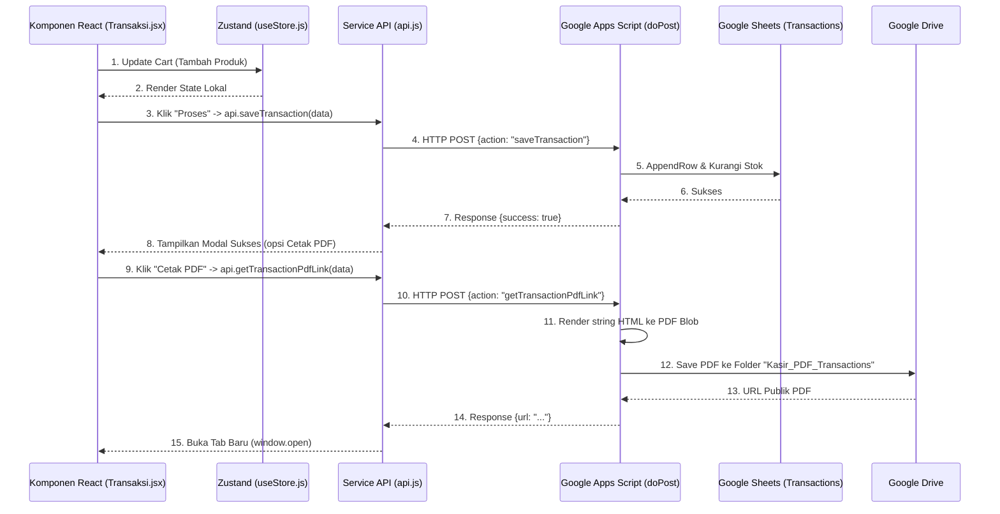

# Dokumentasi Arsitektur & Alur Data Aplikasi Kasir

Aplikasi Kasir ini adalah sistem modern berbasis web yang dibangun menggunakan **React (Vite)** di bagian frontend dan **Google Apps Script + Google Sheets** sebagai platform database dan backend. Berikut adalah analisa lengkap mengenai bagaimana data mengalir dan diproses di dalam sistem.

---

## 1. Arsitektur Komponen Utama

Aplikasi ini mengusung arsitektur **Serverless** di mana backend tidak berdiri pada server konvensional (seperti Node.js/PHP VPS), melainkan dilayani penuh oleh infrastruktur Google Workspace.

*   **Frontend (Browser):** React.js + TailwindCSS + Zustand
*   **Service Layer / API:** Fetch API native (berkomunikasi dengan Apps Script `doPost`)
*   **Backend (Serverless):** Google Apps Script (`backend_apps_script.js`) 
*   **Database:** Google Sheets (sebagai tabel RDBMS)
*   **File Storage:** Google Drive (untuk menyimpan struk/invoice PDF)

---

## 2. Alur Data (Data Flow) - End-to-End

Berikut adalah gambaran bagaimana sebuah aksi pengguna (Misal: Membuat Transaksi Penjualan) diproses dari layar hingga tersimpan di Google Sheets dan Drive.

---

## 3. Detail Layer Frontend

### State Management (`useStore.js`)
State diatur secara terpusat (Global Store) menggunakan perpustakaan **Zustand**. Terdapat dua jenis data dalam perlakuan sistem:
1.  **Transient Data (Hilang bila refresh):** Cart (Keranjang belanja), Data Master Produk, Data Konsumen. Biasanya di-*fetch* langsung dari database setiap aplikasi dimuat.
2.  **Persistent Data (Aman di LocalStorage):** Settings (Pengaturan toko), QuotationSettings, dan TransactionSettings (logo, footer, template nota yang aktif). Data ini menggunakan _Persist Middleware_ sehingga pengaturan tampilan tidak akan kereset meski browser ditutup.

### Sinkronisasi Tampilan Aplikasi vs Hasil Final (PDF)
Aplikasi menjamin sistem **WYSIWYG** *(What You See Is What You Get)*. Logika template (Profesional, Minimalis, dsb) ditulis **dua kali**:
- Di **Pihak Frontend (React)**: Ditulis menggunakan komponen JSX dalam `Quotation.jsx` atau `Transaksi.jsx`. Tujuannya untuk mencetak cepat lewat print browser (`window.print()`).
- Di **Pihak Backend (Apps Script)**: Ditulis ulang menggunakan penggabungan string HTML biasa (`generateMinimalistHtml`, dsb). Tujuannya untuk dibaca oleh engine Google Workspace dan diubah menjadi *file PDF absah* bernilai arsip.

---

## 4. Detail Layer Penghubung (API Service)

Layer penghubung dienkapsulasi pada file `/src/services/api.js`. 
- Fungsi `request(action, data, method = 'POST')` berfungsi mendistribusikan semua panggillan ke satu `SCRIPT_URL` Google Apps Script.
- Terdapat sistem **MOCK_MODE** (`const MOCK_MODE = false;`). Jika ini aktif, aplikasi tidak akan pernah menghubungi server cloud dan akan berasumsi setiap transaksi berhasil/mengembalikan data dummy. Ini berguna untuk _Development_ lokal.

---

## 5. Detail Layer Backend & Database

Pada Google Apps Script, satu fungsi pusat bertugas mengarahkan *traffic* logik. 
Metode yang digunakan adalah **Single Endpoint Routing**:
- Semua request masuk ke `function doPost(e)`.
- Backend membaca `e.postData.contents`.
- Merutekan (`switch/case`) berdasarkan properti `action` yang dikirim dari React (Misal: `getProducts` memanggil fungsi backend `getProducts()`).

### Struktur Skema "Database" (Google Sheets)
Aplikasi mengenali lembar (sheet) Google Sheets tidak sekadar sebagai sel, melainkan sebagai baris basis data komprehensif.

| Nama Sheet | Fugsi | Keterangan |
| :--- | :--- | :--- |
| **Products** | Menyimpan master data barang | Kolom stok (F) akan di_update_ langsung otomatis saat terjadi `saveTransaction`. |
| **Transactions** | Menyimpan riwayat penjualan | Termasuk metrik Grand Total dan Item yang di-*stringify* JSON. |
| **Quotations** | Arsip penawaran harga | Penawaran harga bersifat *stateless* terhadap inventori (tidak memotong stok barang). |
| **Customers** | Manajemen Pelanggan / Sales | Digunakan untuk mengisi autofill pembeli saat transaksi berlangsung. |

---

## Kesimpulan

Aplikasi memiliki tumpukan antrian data yang sangat seragam dan statis di sisi cloud (mendongkrak kecepatan), namun sangat interaktif dan asinkronus (Zustand + React) di frontend klien. Beban _rendering_ PDF seutuhnya dikerjakan di infrastruktur cloud serverless, mencegah _device_ konsumen dari *freeze* selagi nota/dokumen dibentuk.
